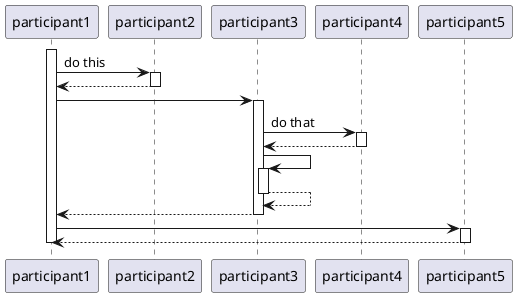

This is a PlantUML Sequence Diagram generator. Of course you can write them in PlantUML, but often i find i could use a much simpler way to express the sequence. So here it is.

Live rudimentary demo at https://eelcoh.github.io/ 

It is an indent based syntax. The sequence starts with the statement
```
sequence participant1
```

Then next, use indented lines for every step in the sequence.
```
sequence participant1
    participant2
    participant3
        participant4
        participant3
    participant5
```

To add captions on the arrows, add a colon and the caption text (not applicable for the `sequence` statement).
```
sequence participant1
    participant2: do this
    participant3
        participant4 : do that
        participant3
    participant5
```

This will output the following PlantUML sequence:

